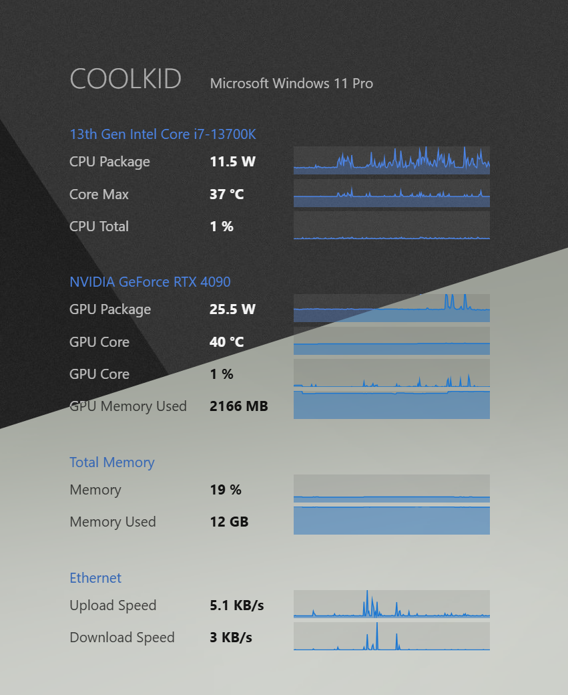
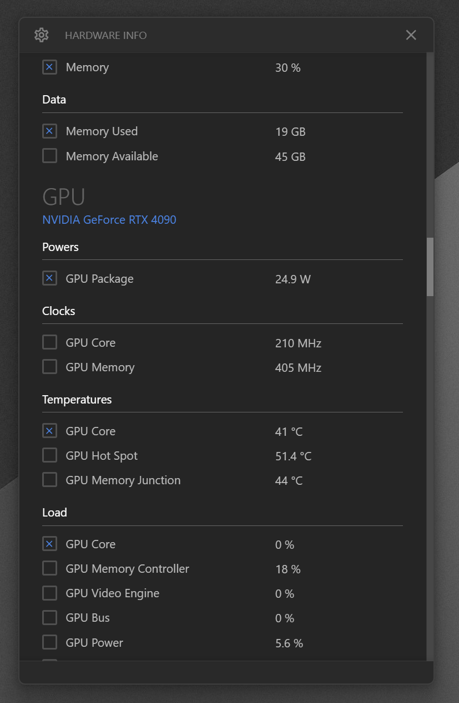

# Electron LibreMon

Desktop hardware monitoring widget for Windows using LibreHardwareMonitor.

**Highly optimized** — near-zero CPU usage (~0%) with ~200MB memory footprint.

## Features

- **Real-time Hardware Monitoring**: CPU, GPU, RAM, storage, network, motherboard sensors
- **Desktop Widget**: Transparent, frameless overlay with live hardware stats and graphs
- **Settings Window**: Detailed sensor information and configuration
- **Sensor Group Configuration**: Enable/disable hardware categories (CPU, GPU, Memory, etc.)
- **System Tray Integration**: Quick access to widget and settings
- **Centralized Reporting**: Optional data transmission to backend server for multi-machine monitoring
- **Low Resource Usage**: N-API native addon with direct hardware access, minimal dependencies

## Screenshots

*Dark / Light Mode*



*Settings Window*




## Requirements

- Windows 10/11
- Administrator privileges (required for hardware sensor access)
- No external dependencies - .NET 9.0 runtime bundled with addon

## Installation

```bash
# Clone with submodules
git clone --recurse-submodules https://github.com/herrbasan/Electron_LibreMon.git
cd Electron_LibreMon

# Install dependencies
npm install

# Run
npm start

# Package
npm run package
```

## Configuration

Settings are stored in `config.json` and editable via the settings UI:

- **Ingest Server**: Backend endpoint for centralized data collection
- **Poll Rate**: Data polling interval (default: 1000ms)
- **Sensor Groups**: Hardware categories to monitor
- **Sensor Selection**: Individual sensors to display/report
- **Start at Login**: Launch at Windows startup

## Architecture

- **Electron** desktop application with system tray
- **N-API Native Addon** for direct LibreHardwareMonitor integration
- **Custom NUI Framework** for lightweight UI components
- **Performance-first**: <200MB memory, ~400ms poll time

## Development

VS Code must run as Administrator for hardware sensor access.

The N-API addon is built from the `LibreHardwareMonitor_NativeNodeIntegration` submodule and includes a self-contained .NET 9.0 runtime.

## Troubleshooting

### Missing or Incorrect Sensor Values

If sensors are missing or showing incorrect/zero values, the most common cause is a missing or broken **PawnIO driver** installation.

**PawnIO** is a kernel driver required by LibreHardwareMonitor for accessing many hardware sensors including:
- CPU temperatures and voltages
- Fan speeds
- Embedded controller data
- Some motherboard sensors

**How to fix:**

1. **Check if PawnIO is installed:**
   - Open Services (`services.msc`) and look for "PawnIO"
   - Or run: `sc.exe query PawnIO` in an admin command prompt

2. **If the service doesn't exist:**
   - Download PawnIO from https://pawnio.eu/ (Official signed edition)
   - Run the installer as Administrator
   - Restart the app

3. **If you get "previous installation found" error:**
   - Run the PawnIO uninstaller first, or
   - Delete the registry key: `HKLM\SOFTWARE\Microsoft\Windows\CurrentVersion\Uninstall\PawnIO`
   - Then reinstall PawnIO

4. **If installation fails with error 0x430/1072:**
   - This means "service marked for deletion"
   - Reboot your computer and try again

**Note:** The app attempts to install PawnIO automatically on first run. If this fails, manual installation as described above should resolve the issue.

## Acknowledgements

- [LibreHardwareMonitor](https://github.com/LibreHardwareMonitor/LibreHardwareMonitor) — The excellent open-source hardware monitoring library that powers this application
